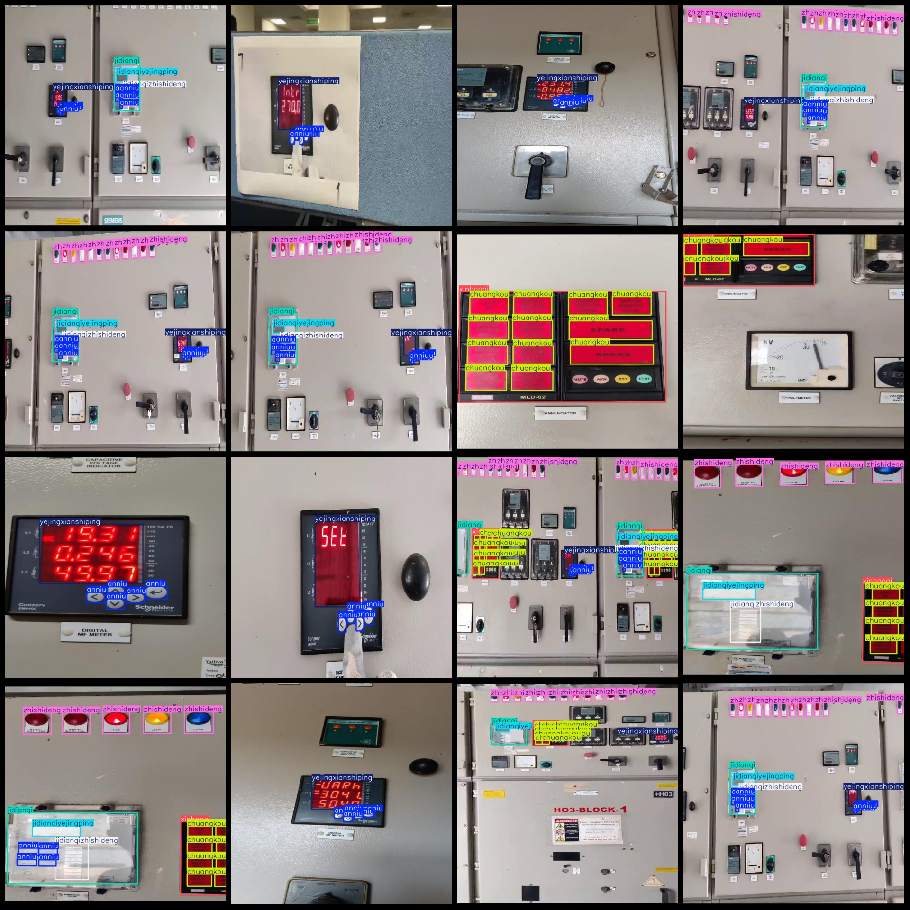
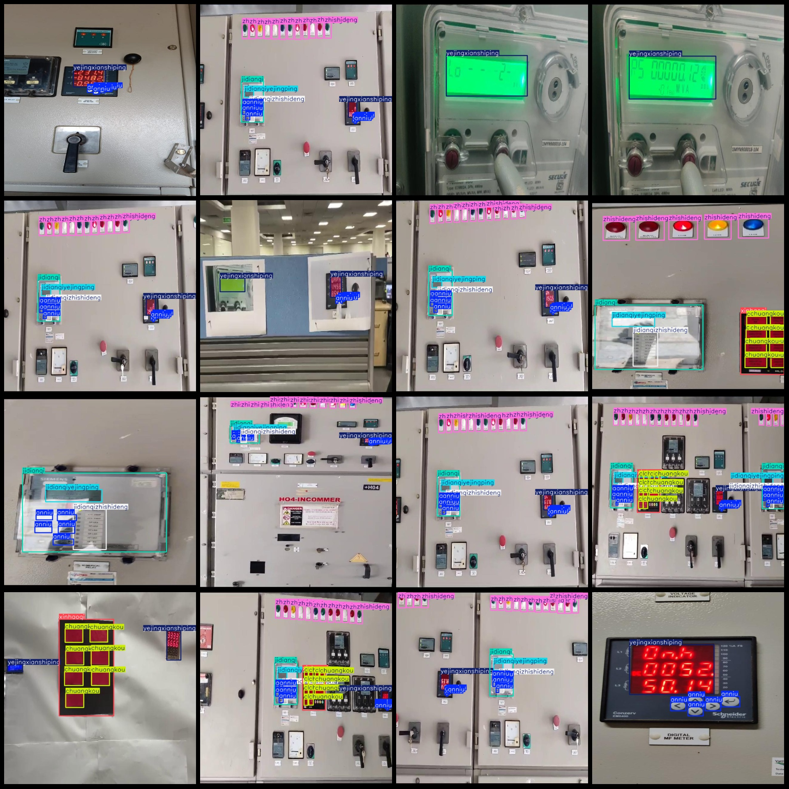

# Smart Industrial Controller Panel PLC Parts and Electronics LCD Part Detection Data Set (VOC+YOLO format, 365 images in Pascal VOC format + YOLO format without split paths, only including JPG 
images and corresponding VOC-formatted XML files and YOLO-formatted txt files)

Dataset Format: Pascal VOC format + YOLO format (excluding split path txt files, only containing JPG images and corresponding VOC-formatted xml files and YOLO-formatted txt files)
Number of Images (JPG file count): 365
Number of Annotations (xml file count): 365
Number of Annotations (txt file count): 365
Number of Annotation Categories: 8
Annotation Category Names (note that the order of categories in the YOLO format does not correspond to this, but is based on the labels folder "classes.txt"): ["anniu", "chuangkou", "jidianqi", 
"jidianqiyejingping", "jidianqizhishideng", "xinhaoqi", "yejingxianshiping", "zhishideng"]
Number of Boxes per Category:
anniu (button) = 1771
chuangkou (window) = 1103
jidianqi (relay) = 197
jidianqiyejingping (relay liquid crystal screen) = 188
jidianqizhishideng (relay indicator light) = 169
xinhaoqi (signal device) = 123
yejingxianshiping (liquid crystal display screen) = 339
zhishideng (light indicator) = 2031
Total Boxes: 5921
Number of Images per Category:
anniu (button) = 228
chuangkou (window) = 117
jidianqi (relay) = 172
jidianqiyejingping (relay liquid crystal display) = 164
jidianqizhishideng (relay indicator light) = 152
xinhaoqi (signal device) = 117
yejingxianshiping (liquid crystal display screen) = 306
zhishideng (indicator light) = 172
Image Resolution: 640x640
Annotation Tool: labelImg
Annotation Rules: Draw a rectangular box around the category
Important Notice: The dataset does not have separate training, validation, or test sets; you need to divide them yourself.
Special Notice: This dataset does not guarantee the accuracy of the trained models or weight files.
Image Preview:
## Image

Here is a pay link on Stripe ( https://buy.stripe.com/3cs8yP7sY87d0vu9AB ). Please contact me lonlonago@foxmail.com after funding $89, and I will send you a complete data files , thank you!

